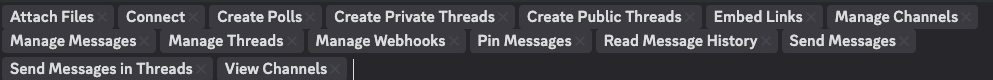
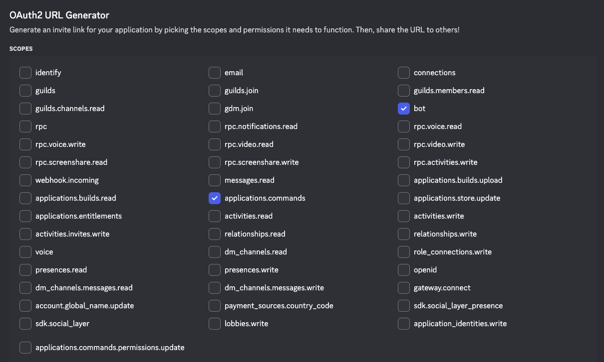
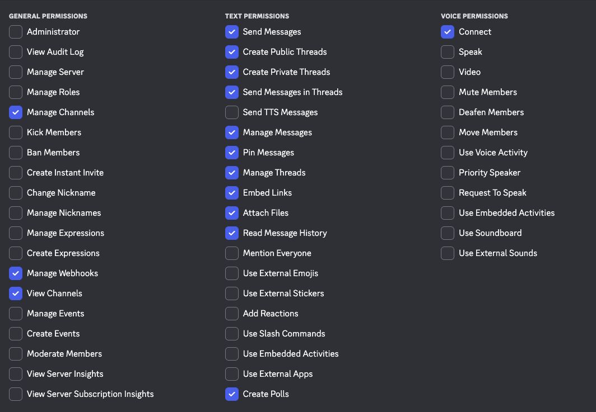

# Discord Bot Onboarding Checklist

## Step 1: Create Discord Application
### 1.1 Create Bot Application (user)
- [ ] Navigate to [Discord Developer Portal](https://discord.com/developers/applications)
- [ ] Click "New Application"
- [ ] Name bot using the format: `{AgentFirstName} (AI)`
- [ ] Agree to terms
- [ ] Click "Create"
- [ ] Click past Captcha

### 1.2 General Information (user)
- [ ] Add App Icon (bot headshot):
  - Click on the circular avatar placeholder at the top of the General Information page
  - Select an appropriate headshot image file (PNG, JPG, GIF supported; square format recommended for best appearance, at least 512x512 pixels)
  - Discord will automatically crop it to a circle - ensure important elements are centered
- [ ] Add Description:
- [ ] Add Description:
   - In the "Description" field, enter a brief description of the bot that aligns with your organization's standards.
- [ ] Add Tags:
  - Click in the "Tags" field
  - Enter: "agents", "bot", "chat", "ai"
- [ ] Copy and save the Application ID and Public Key:
  - Both are displayed under "Tags"
  - Click the "Copy" button next to them
  - Paste it into a secure note/document for safekeeping (you'll need this for environment configuration)
- [ ] Click Save Changes

### 1.3 Installation (user)
- [ ] Install Contexts
  - Uncheck 'User Install'
- [ ] Default Install Settings
  - Add "bot" to the Guild Install Scopes so that it shows "applications.commands" and "bot"
- [ ] Permissions
  - Add these permissions:
    - Attach Files
    - Connect
    - Create Polls
    - Create Private Threads
    - Create Public Threads
    - Embed Links
    - Manage Channels
    - Manage Messages
    - Manage Threads
    - Manage Webhooks
    - Pin Messages
    - Read Message History
    - Send Messages
    - Send Messages in Threads
    - View Channels
  - 
- [ ] Click Save Changes

### 1.4 OAuth2 (user)
- Click on the "OAuth2" tab in the left sidebar
- [ ] Select scopes:
  - In the "Scopes" section, check the boxes for:
    - `bot`
    - `applications.commands`
  - 
- [ ] Select permissions:
  - In the "Bot Permissions" section, check the following boxes:
    - **General Permissions:**
      - Manage Channels
      - Manage Webhooks
      - View Channels
    - **Text Permissions:**
      - Send Messages
      - Create Public Threads
      - Create Private Threads
      - Send Messages in Threads
      - Manage Messages
      - Pin Messages
      - Manage Threads
      - Embed Links
      - Attach Files
      - Read Message History
      - Create Polls
    - **Voice Permissions:**
      - Connect
  - 
- [ ] Copy generated URL:
  - The invite URL will be generated at the bottom
  - Click the "Copy" button to copy the full URL to your clipboard

### 1.5 Configure Bot Settings (user)
- [ ] Navigate to "Bot" tab:
  - Click on the "Bot" tab in the left sidebar of the Discord Developer Portal
- [ ] Copy Token:
  - Click the blue "Reset Token" button to reset the token
  - Confirm by clicking "Yes, do it!" in the popup
  - Enter password and submit when prompted
  - Click the blue "Copy" button to copy the token
  - If the token is not shown, you may have to reset the token again
- [ ] **DISABLE** "Public Bot" (keep private):
  - Locate the "Public Bot" toggle under "Authorization Flow"
  - Ensure it is set to OFF (grayed out)
  - NOTE: Must complete OAuth2 URL Generator (Step 1.4) first to avoid error
- [ ] **ENABLE** "Message Content Intent":
  - Under "Privileged Gateway Intents", toggle "Message Content Intent" to ON
- [ ] **ENABLE** "Server Members Intent":
  - Toggle "Server Members Intent" to ON
- [ ] **ENABLE** "Presence Intent":
  - Toggle "Presence Intent" to ON
- [ ] Click Save Changes

## Step 2: Add Bot to Server
### 2.1 Invite Bot (user)
- [ ] Use invite URL from Step 1.4
- [ ] Select target Discord server
- [ ] Authorize with selected permissions

### 2.2 Get Bot User ID (user)
- [ ] Enable Developer Mode in Discord (User Settings > Advanced)
- [ ] Right-click bot in member list
- [ ] Select "Copy ID"
- [ ] Save Bot User ID securely

## Step 3: Create Bot Environment
### 3.1 Create Environment File (bot or user)
- [ ] Create `.env.<bot-name>` file with specified content

### 3.2 Secure Environment File (bot or user)
- [ ] Set proper permissions: `chmod 600 .env.<bot-name>`
- [ ] Verify `.env.*` files are in `.gitignore`

## Step 4: Create Webhooks

### 4.1 Create Bot Webhook (bot or user)
- [ ] Run: `node create-webhooks.js <channel-id> <bot-name>`
- [ ] If you get "Maximum number of webhooks reached (15)" error:
  - Run `node check-webhooks.js <channel-id>` to see existing webhooks
  - Manually delete old/duplicate webhooks in Discord:
    1. Right-click channel → Edit Channel
    2. Go to Integrations tab → Webhooks section
    3. Click on each old webhook
    4. Click "Delete Webhook" button at bottom
    5. Confirm deletion
  - Re-run `node create-webhooks.js <channel-id> <bot-name>`

### 4.2 Update Environment File (bot or user)
- [ ] Webhook ID and token automatically updated in `.env.<bot-name>` by script

### 4.3 Configure DM Channel (user)
- [ ] Send DM to bot in Discord (creates DM channel)
- [ ] Right-click DM channel in Discord UI → Copy Channel ID
- [ ] Provide channel ID to bot to add to `.env.<bot-name>` in `DM_CHANNEL_IDS=` field

## Step 5: Role Management
### 5.1 Assign Shared Role (bot or user)
- [ ] Run: `node assign-role.js "<role-name>" <bot-name> <admin-bot-name>`

## Step 6: Test Bot Configuration
### 6.1 Verify Channel Access (bot or user)
- [ ] Run: `node list-channels.js <bot-name>`

### 6.2 Test Messaging (bot or user)
- [ ] Run: `node test-send-message.js <bot-name> --dms-only`
- [ ] Run: `node send-message.js <bot-name> <channel-id> "Test message"`

### 6.3 Verify Role Assignment (bot or user)
- [ ] Run: `node list-roles.js <bot-name>`

## Step 7: Deploy Bot
### 7.1 Add to Bot Control (user)
- [ ] Update `botctl` script to include bot in BOTS array

### 7.2 Start Bot (bot)
- [ ] Run: `./botctl restart` to include new bot

### 7.3 Verify Startup (bot)
- [ ] Run: `./botctl logs` to check system logs
- [ ] Run: `./botctl status` to check bot status

## Step 8: Final Validation
### 8.1 Discord Integration (user)
- [ ] Bot appears online in Discord server
- [ ] Bot has correct roles assigned
- [ ] Bot can send messages to channels
- [ ] Bot can receive and process @mentions
- [ ] Webhook messages work correctly

### 8.2 Channel Access (user)
- [ ] Bot can access required guild channels
- [ ] DM functionality works (if configured)

### 8.3 System Integration (bot)
- [ ] Bot starts via botctl without errors
- [ ] Bot logs are generated correctly
- [ ] Environment variables are loaded properly

### 8.4 Security Verification (bot or user)
- [ ] Bot token is secure and not exposed in logs
- [ ] Webhook credentials are unique to bot
- [ ] ~~Bot is not public (invite URL restricted)~~

## Troubleshooting Checklist (if issues occur)
### Bot Not Responding
- [ ] Check bot token validity
- [ ] Verify bot is online in Discord
- [ ] Check botctl logs for errors
- [ ] Verify .env file permissions (600)

### Permission Errors
- [ ] Check bot roles in Discord server
- [ ] Verify channel permissions
- [ ] Re-run role assignment scripts if needed

### Webhook Issues
- [ ] Verify webhook credentials in .env file
- [ ] Check webhook exists in target channel
- [ ] Recreate webhook if necessary

## Security Reminders
- [ ] Never commit .env files to version control
- [ ] Keep bot tokens secure and rotate if compromised
- [ ] Use server whitelisting for production bots
- [ ] Regularly audit bot permissions and access
- [ ] Monitor bot activity logs for unusual behavior

## Maintenance Tasks
- [ ] Monitor bot uptime and performance
- [ ] Update bot permissions as needed
- [ ] Rotate credentials periodically
- [ ] Review and clean up old logs
- [ ] Update documentation as system evolves
